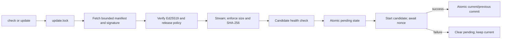
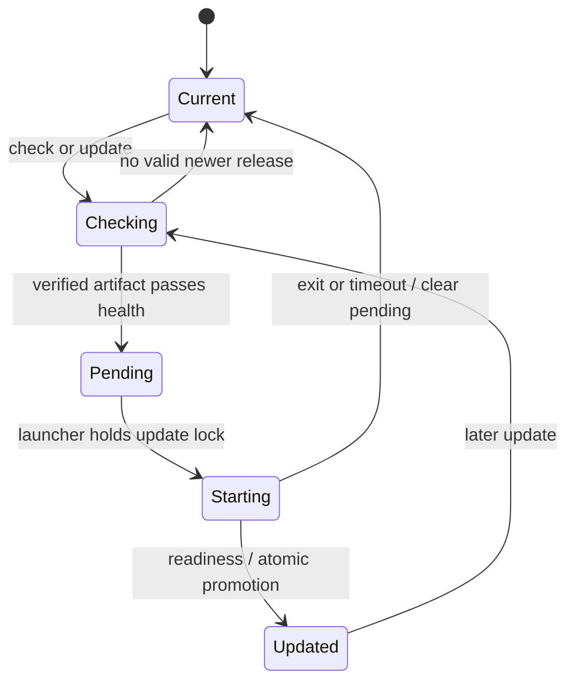

# Architecture

## Goals and boundaries

WordShift is a manually updated, per-user desktop application for Windows x86-64, macOS ARM64, and
Linux x86-64. PyInstaller builds one self-contained artifact on each native platform.

One artifact per platform is not one mutable installed file. Installation copies that artifact into
a stable launcher and a versioned payload. Updates add payloads and change an atomic state pointer;
they never replace a running executable.

Background scheduling, fleet rollout, telemetry, delta updates, platform code signing, launcher/key
rotation, and payload garbage collection are outside this exercise.

## Components and state machine



The executable has three public roles: standalone installer, stable launcher, and versioned payload.
A hidden health mode supports candidate validation.



The launcher keeps `current` unchanged while a pending payload starts. It holds `update.lock` through
the bounded readiness check. On success, one atomic state write sets `current=pending`, moves the old
current to `previous`, and clears `pending`. On failure, it stops the candidate and clears only
`pending`. A normal command then runs the old current once; a failed `update` reports the error
without repeating the old update command.

A payload exits with code 75 after staging an update. The launcher restarts only when state contains
a pending version or another launcher already committed a strictly newer current version. Three
consecutive restarts are allowed.

## Invariants

1. Installed state changes only while `update.lock` is held.
2. Ed25519 verifies the exact manifest bytes before parsing.
3. Schema, target, version, time, HTTPS URL, size, and SHA-256 pass before execution.
4. Releases move only to a greater semantic version.
5. The old version remains current until the pending candidate reports readiness.
6. `state.json` changes atomically and remains schema version 1.
7. Updates never replace the stable launcher.
8. State retains one previous version for rollback.

## Release trust

Each target release has an executable, JSON manifest, and manifest signature:

```text
wordshift-<os>-<arch>[.exe]
wordshift-<os>-<arch>[.exe].json
wordshift-<os>-<arch>[.exe].json.sig
```

The stable discovery URL points to `releases/latest/download/...`. The signed manifest points to an
immutable tag-specific artifact and binds its version, target, timestamps, exact size, and SHA-256.
The client verifies signature, policy, and artifact bytes independently of release storage.

A storage or network attacker can block an update or replay an unexpired signed release. They cannot
forge a manifest without the private key, substitute artifact bytes without a hash failure, or
downgrade installed state. Host and signing-key compromise remain outside this design.

The release workflow runs lint, strict typing, and tests before each native build, then expects a
protected signing environment and separate feed token to create a draft. Those secrets are neither
committed nor currently configured. The v1.2 release is signed locally with the existing
off-repository demo key. Production key custody should use offline signing or KMS/HSM approval;
Authenticode and Apple signing/notarization should follow.

Normal manifests expire after 30 days. A separately named, tag-pinned v1.1 demo manifest expires in
2036 so the historical public walkthrough remains reproducible without changing normal policy.

## Filesystem, permissions, and recovery

```text
install-root/
├── wordshift[.exe]                 stable launcher
├── state.json
├── update.lock
├── versions/
│   ├── 1.0.0/wordshift[.exe]
│   ├── 1.1.0/wordshift[.exe]
│   └── 1.2.0/wordshift[.exe]
├── staging/
└── readiness/
```

On POSIX, managed directories are created or normalized to `0700`, and symbolic-link directories
are rejected. Windows keeps the user's inherited ACLs. Linux uses `XDG_DATA_HOME` only when it is
nonempty and absolute; otherwise it uses `$HOME/.local/share`.

State is written beside its destination, flushed, fsynced, and committed with `os.replace`.
Payload promotion uses a same-filesystem directory rename. State tracks only `current`, `previous`,
and `pending`; older payload directories can remain on disk and are not garbage-collected.

| Failure | Result |
|---|---|
| Manifest network, signature, schema, policy, or expiry failure | Keep current |
| Artifact timeout, oversize, truncation, or hash mismatch | Remove staging; keep current |
| Candidate health failure | Do not mark pending |
| Crash before readiness commit | Old current and pending candidate remain; next launch retries |
| Candidate exits or misses readiness | Clear pending; keep current; run it once for normal commands |
| Missing pending payload | Clear pending and run current |
| Missing current with a retained previous payload | Atomically recover previous |
| Corrupt state without a valid fallback | Stop with an explicit error |

The lock serializes staging and pending activation. A second launcher may time out while the first
waits up to ten seconds for candidate readiness; it cannot independently promote or roll back the
same transition.

## Platform choices and alternatives

| | Windows | macOS | Linux |
|---|---|---|---|
| Executable | `wordshift.exe` | `wordshift` | `wordshift` |
| Default root | `%LOCALAPPDATA%\WordShift` | `~/Library/Application Support/WordShift` | XDG data home |
| Published CI target | x86-64 | ARM64 | x86-64 |

Runtime target normalization also supports other OS/architecture pairs for custom feeds. Default
discovery rejects pairs not published by this repository.

The stable launcher was selected for predictable Windows execution and rollback. Direct
self-replacement is platform-specific and crash-prone. Native updater frameworks would hide the
mechanisms being evaluated. GitHub Releases is enough for a static feed; `ReleaseSource` keeps an R2
bucket or Worker replaceable later if scale or policy requires it.

Because the launcher is intentionally immutable, updater fixes cannot reach a launcher installed
from v1.0 or v1.1 through a payload update. Fresh v1.2 installations contain the fixes; existing
installations need reinstalling until a separately signed launcher migration protocol exists.
