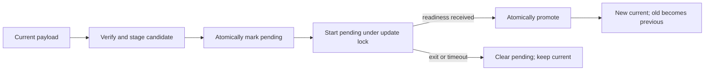

# WordShift

WordShift is a tiny text-transform CLI that demonstrates signed, recoverable self-updates on
Windows, macOS, and Linux. The payload is deliberately simple; the updater is the exercise.

Installation creates a stable launcher and immutable versioned payloads. An update downloads a new
payload, verifies it, starts it, waits for readiness, and only then atomically makes it current. The
running launcher is never overwritten.

## Five-minute review

Install [uv](https://docs.astral.sh/uv/), clone this repository, and run:

```text
uv run task.py demo
```

This is a real, isolated v1.0 → v1.1 update. The command downloads and SHA-256 verifies v1.0,
installs it under a temporary directory, updates through the public signed feed, verifies the final
state, and removes the temporary installation. It does not install WordShift permanently.

```text
WordShift 1.0.0
wordshift: error: unrecognized arguments: --json
update available: 1.1.0
staged 1.1.0; restarting
up to date: 1.1.0
WordShift 1.1.0
{"input": "Hello, world!", "output": "Ellohay, orldway!"}
{"current_version":"1.1.0","pending_version":null,"previous_version":"1.0.0","schema_version":1}
verified: updated 1.0.0 -> 1.1.0; launcher unchanged; rollback retained
```

The rejected JSON flag makes the payload change visible: v1.0 lacks it and v1.1 adds it. The
published v1.0 and v1.1 artifacts remain immutable historical fixtures.

## Current version

The source tree and [v1.2.0 release](https://github.com/joryeugene/wordshift-update-feed/releases/tag/v1.2.0)
add ROT13 without changing the updater protocol:

```text
$ uv run wordshift version
WordShift 1.2.0
$ uv run wordshift transform --rot13 "Hello, world!"
Uryyb, jbeyq!
$ uv run wordshift transform --rot13 --json "Hello, world!"
{"input": "Hello, world!", "output": "Uryyb, jbeyq!"}
```

`uv run wordshift` runs the source checkout; it does not install WordShift. To build and install the
current artifact in a chosen directory:

```text
uv run task.py build
./dist/wordshift install --root ./wordshift-install --artifact ./dist/wordshift
./wordshift-install/wordshift version
```

On Windows, use `dist\wordshift.exe` and `wordshift-install\wordshift.exe`.

## Develop and verify

The same task commands work on every published target:

| Command | Runs |
|---|---|
| `uv run task.py test` | Ruff, strict mypy, pytest, and coverage |
| `uv run task.py build` | Native PyInstaller build and binary smoke test |
| `uv run task.py demo` | Public v1.0 → v1.1 update |
| `uv run task.py verify` | Test, build, and demo |

PyInstaller does not cross-compile. [CI](https://github.com/joryeugene/cross-platform-self-updater/actions)
runs native Linux x86-64, macOS ARM64, and Windows x86-64 jobs. It tests a frozen v1.0-feature
baseline → v1.2 promotion with the fixed launcher, readiness failure, rollback, tamper rejection, and
unchanged launcher bytes. That feature-limited v1.0 baseline is generated from current launcher
code; the public demo above uses the immutable historical v1.0 launcher.

## Design



Ed25519 authenticates the exact manifest bytes before JSON parsing. The signed manifest binds the
version, target, publication and expiry times, immutable artifact URL, byte count, and SHA-256.
GitHub Releases delivers files but is not an authenticity authority.

See [ARCHITECTURE.md](ARCHITECTURE.md) for the state machine, trust boundaries, crash behavior, and
tradeoffs.

## Releases and known limits

The separate [release feed](https://github.com/joryeugene/wordshift-update-feed) holds the binaries,
manifests, and signatures. Normal `latest` manifests expire after 30 days. The tag-pinned v1.1 demo
manifest expires in 2036 so the interview walkthrough remains reproducible.

- Updates are manually triggered. State records one rollback version; older version directories are
  not garbage-collected.
- POSIX updater directories are private (`0700`). Windows uses inherited per-user ACLs.
- The stable launcher does not update. Launcher fixes in v1.2 protect fresh installs; an older
  installation must be reinstalled. A signed launcher/key migration is future work.
- Artifacts are not Authenticode-signed or Apple-notarized.
- The release workflow expects protected signing and feed secrets, but none are committed or
  currently configured. v1.2 was signed locally with the off-repository demo key. Production should
  use offline or KMS/HSM signing with approval controls.
